# DeMAF Type Definitions

In this repository we provide the definitions of abstract component and relation types the DeMAF uses to create EDMM models either as

1. [EDMM Yaml files](edmm/)
1. or corresponding definitions of [TOSCA node types and relationship types](tosca/)

The DeMAF Type Definitions are loosely based on a mix of

1. the types defined in the [EDMM modeling repository](<https://github.com/UST-EDMM/modeling-repository>)
1. and the normative types of the TOSCA Simple Profile v1.3 as defined in the [Standard](https://docs.oasis-open.org/tosca/TOSCA-Simple-Profile-YAML/v1.3/os/TOSCA-Simple-Profile-YAML-v1.3-os.html#_Toc269694699) and the
[GitHub Repository](<https://github.com/OpenTOSCA/tosca-normative-types-repository>)

The DeMAF Type Definitions may be modified and extended in the future.

## Examples

We provide some examples of technology-specific deployment models and their corresponding EDMM model using the type system in [examples](examples/).
In examples/winery we provide TOSCA models generated from the EDMM models for importing and viewing them in Eclipse Winery.

## Component Types

The following diagram shows the Component Type hierarchy, including concrete types that may be generated by the DeMAF based on the input deployment model:

## Relation Types

The following diagram shows the Relation Type hierarchy:

